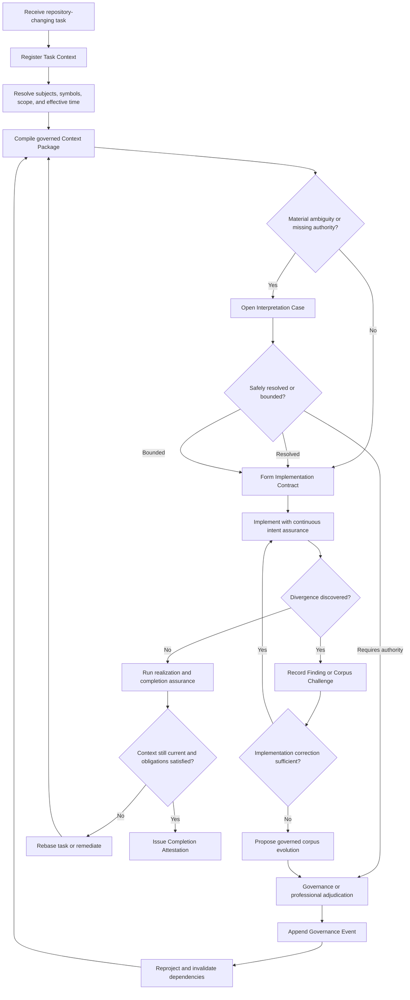

# JPWB-CON-ICI-001 — Coding-Agent Operational Concept and User Journeys for the Governed Intent Corpus Capability

## 0. Document status and use

This document is a **proposed operational concept and user-journey specification**. It is not yet a ratified authority artifact.

It defines the intended experience and observable behavior of a capability through which a coding agent obtains, interprets, realizes, challenges, and remains synchronized with an evolving normative, prescriptive, and deontic corpus.

This document does **not** define the final persistence architecture, graph schema, model orchestration, API contract, governance authority hierarchy, or corpus change procedure. Those designs SHALL conform to the operational requirements and journeys established here after this document is ratified.

The working service name **Intent Authority Service** is used for readability. The product name remains unsettled.

---

## 1. Purpose

The Governed Intent Corpus Capability SHALL enable a repository-changing coding agent to:

1. identify the professional intent that governs a requested software change;
2. obtain a task-bounded and provenance-preserving Context Package;
3. distinguish effective authority from interpretation, evidence, and current implementation behavior;
4. investigate semantic ambiguity without collapsing materially different concepts;
5. convert applicable authority into a validated Implementation Contract;
6. realize that contract in source code while continuously checking input provenance, authority, evidence, and bypass paths;
7. detect whether a defect lies in the implementation, the corpus, the governance record, or some combination thereof;
8. propose corpus corrections through the applicable governance procedure rather than destructively editing governed history;
9. continue safely where uncertainty can be bounded without inventing an authoritative answer;
10. rebase ongoing work when corpus governance changes alter applicable authority;
11. decompose large investigations among multiple agents and recompose their results without laundering uncertainty or shared assumptions; and
12. produce a reproducible Completion Attestation identifying what was implemented, under which effective corpus state, and with what evidence.

The capability SHALL make lexical search, semantic retrieval, graph traversal, repository analysis, autonomous interpretation, adversarial refutation, governance projection, and Context Package compilation available as coordinated functions. None of those functions alone SHALL be treated as the product.

---

## 2. Problem statement

Coding agents currently search large professional-intent corpora primarily through filenames, exact tokens, `grep`, embeddings, prompt-provided excerpts, or manually accumulated conversational context. These mechanisms are useful for locating candidate evidence, but they do not reliably answer questions such as:

- What currently governs this implementation decision?
- Which source has controlling authority?
- Has a provision been superseded, narrowed, excepted, challenged, or reopened?
- Does a field name refer to the same concept described elsewhere in prose?
- Is a declared lifecycle operational or merely represented in schemas?
- Does a correct guard consume evidence from the correct party?
- Is an apparent defect in code, in the corpus, in a prior interpretation, or in the governance record?
- What may the agent safely implement while an ambiguity remains unresolved?
- Has a governance update invalidated the context under which the agent began work?

The corpus SHALL NOT be assumed infallible. A ratified artifact may be incomplete, stale, internally inconsistent, incorrectly summarized, or divergent from implementation reality. At the same time, a coding agent SHALL NOT acquire authority to rewrite governed intent merely because it detects a likely defect.

The capability must therefore support both:

- **effective-authority consumption**, through which the agent learns what currently governs; and
- **governed corpus evolution**, through which findings, challenges, corrections, scoped supersessions, clarifications, exceptions, and other authorized acts change the effective projection without erasing history.

---

## 3. Scope

### 3.1 In scope

This operational concept covers:

- task registration and subject resolution;
- Context Package compilation;
- authority explanation and deepening;
- interpretation cases;
- implementation-contract formation;
- continuous intent assurance during coding;
- divergence detection and classification;
- corpus challenges and governed change proposals;
- uncertainty-bounded continuation;
- governance-change notification and task rebasing;
- multi-agent decomposition and recomposition;
- completion attestation;
- historical reconstruction of an earlier agent decision.

### 3.2 Out of scope

This document does not finalize:

- database technology;
- graph-database selection;
- embedding model selection;
- prompt templates;
- final agent topology;
- user-interface visual design;
- final authorization policy;
- the exact artifact taxonomy for every Janumi corpus family;
- the root meta-governance procedure;
- the final MCP, REST, event, or command schemas.

### 3.3 Primary product boundary

The capability SHALL begin when a coding agent receives or formulates a repository-changing task and SHALL remain involved until the task is completed, abandoned, invalidated, or superseded.

The capability SHALL NOT be limited to an initial retrieval step. It SHALL remain synchronized with:

- repository changes;
- evidence generation;
- findings;
- interpretation changes;
- governance events;
- Context Package validity; and
- completion assurance.

---

## 4. Normative conventions

Within this document:

- **SHALL** and **MUST** indicate mandatory behavior.
- **SHALL NOT** and **MUST NOT** indicate prohibited behavior.
- **SHOULD** indicates expected behavior unless a documented reason justifies deviation.
- **MAY** indicates permitted behavior.

A proposition produced by an LLM or agent SHALL NOT become authoritative merely because it is fluent, probable, repeated, agreed upon by several agents, or stored in an index.

---

## 5. Primary user and supporting actors

## 5.1 Primary user: Repository-Changing Coding Agent

The primary user is an agent authorized to inspect and potentially modify a software repository.

The coding agent may:

- receive tasks from a person, another agent, a work queue, or a PWA/PWU;
- read code, tests, schemas, configuration, documentation, and runtime evidence;
- create implementation plans;
- modify source-controlled artifacts;
- run tests and analysis tools;
- record findings and evidence;
- propose governed changes;
- provide completion evidence.

The coding agent SHALL NOT be presumed authorized to:

- ratify new professional policy;
- destructively edit governed corpus history;
- broaden the meaning of a source provision;
- convert external model knowledge into corpus authority;
- declare its own implementation compliant without applicable assurance;
- silently continue under a stale Context Package.

## 5.2 Supporting actors and services

| Actor or service | Responsibility | Authority effect |
|---|---|---|
| Task initiator | Requests the software change and supplies initial scope | Depends on undertaking authority |
| Source Registry | Preserves identifiable source artifacts and versions | None by ingestion alone |
| Structural and Semantic Compiler | Produces addressable structures and candidate interpretations | None by extraction alone |
| Effective Authority Projector | Computes what currently governs for a declared scope and time | Derivative of valid governance records |
| Repository Analysis Service | Resolves symbols, call paths, schemas, tests, data provenance, and runtime behavior | Evidence-producing only |
| Interpretation Investigator | Generates and evaluates competing interpretations | Epistemic only unless separately authorized |
| Adversarial Refuter | Attempts to defeat a proposed conclusion | Epistemic only |
| Assurance Judge | Applies publication or completion closure policies | As defined by governing assurance policy |
| Governance Authority | Performs or authorizes governance-changing acts | May change effective authority |
| Human professional | Participates only when required authority or judgment cannot be supplied by authorized automation | As delegated or inherently held |

Human participation SHALL be exception-based. The capability SHALL autonomously close ordinary retrieval, interpretation, realization, and assurance work wherever applicable authority and evidence permit closure. It SHALL escalate only the smallest materially consequential question that cannot be safely resolved or bounded.

---

## 6. Governing operational principles

### ICI-OP-001 — Task orientation

The primary interaction SHALL begin with a task, question, implementation target, or observed divergence—not with document browsing.

### ICI-OP-002 — Multi-representation context

The service SHALL preserve source artifacts, structural blocks, atomic propositions, concepts, authority relations, implementation mappings, evidence, and uncertainty as coordinated but distinct representations.

### ICI-OP-003 — Source, interpretation, authority, and realization separation

For every consequential proposition, the service SHALL distinguish:

1. what the source literally states;
2. what an agent or model interprets it to mean;
3. whether and why that interpretation currently governs; and
4. how, whether, and with what evidence the repository realizes it.

### ICI-OP-004 — Effective corpus as projection

The service SHALL treat the current effective corpus as a reproducible projection over preserved source history and governance history. It SHALL NOT treat a mutable graph or rewritten document set as the sole system of record.

### ICI-OP-005 — Search as evidence discovery

`grep`, full-text search, embeddings, code search, and graph traversal MAY locate evidence. None SHALL independently establish authority, equivalence, supersession, applicability, or implementation correctness.

### ICI-OP-006 — Narrowest defensible conclusion

An autonomous interpretation SHALL NOT be broader than its supporting evidence. Where several materially different interpretations survive investigation, the service SHALL preserve them or issue a bounded operational disposition.

### ICI-OP-007 — Non-destructive governed evolution

Where an artifact’s applicable change procedure forbids destructive correction, the service SHALL refuse direct modification and SHALL require the applicable append-only governance act, including scoped supersession where appropriate.

### ICI-OP-008 — Incremental invalidation

A new governance event SHALL trigger dependency analysis. Affected interpretations, projections, Context Packages, Implementation Contracts, and Completion Attestations SHALL be marked stale, superseded, or invalidated as defined by policy.

### ICI-OP-009 — Recomposition assurance

The service SHALL NOT recompose decomposed analyses through ordinary summarization alone. It SHALL preserve premises, dependencies, qualifiers, defeaters, authority status, uncertainty, and shared assumptions.

### ICI-OP-010 — Reproducibility

Every Context Package and Completion Attestation SHALL identify the source snapshot, repository revision, governance revision, interpretation build, and effective-time basis used to produce it.

---

## 7. Agent-visible professional artifacts

The coding agent SHALL interact with durable, typed artifacts rather than relying only on transient chat turns.

| Artifact | Purpose | May alter effective authority? |
|---|---|---:|
| **Task Context** | Binds the requested work to repository, subject, scope, and time | No |
| **Context Package** | Supplies bounded applicable authority, realization mappings, findings, and uncertainty | No |
| **Authority Trace** | Explains why a provision governs and what modifies it | No |
| **Interpretation Case** | Investigates a materially consequential semantic question | No, unless followed by authorized governance |
| **Implementation Contract** | Converts applicable intent into implementation obligations, prohibitions, discretion, and evidence requirements | No; derivative |
| **Finding** | Records an observed divergence, defect, absence, or method failure | No |
| **Corpus Challenge** | Formally contests an effective or recorded proposition | No by challenge alone |
| **Governance Change Proposal** | Proposes a ratification, correction, scoped supersession, clarification, exception, revocation, or other governed act | No until authorized |
| **Governance Event** | Records an authorized act that changes effective authority or governance state | Yes |
| **Uncertainty Record** | Preserves competing interpretations and constrains permissible use | No |
| **Effective Authority Diff** | Explains what changed between governance revisions and how work is affected | No; derivative |
| **Completion Attestation** | Records the realization and assurance result for a completed task | No corpus authority; may govern release under separate policy |
| **Historical Reconstruction** | Rebuilds what was known and effective at an earlier time | No |

Each artifact SHALL have a stable identifier, provenance, lifecycle state, creation time, producing actor or process, and version or event lineage.

---

## 8. End-to-end operational concept



The service SHALL support deepening at any stage. A coding agent MAY ask for exact source spans, authority lineage, competing interpretations, implementation consumers, test coverage, or historical state without abandoning the task context.

---

# 9. User journeys

## ICI-UJ-001 — Register and scope an implementation task

### User goal

The coding agent needs to convert an unstructured task request into a stable, reproducible work context before searching or modifying the repository.

### Running example

> Make `CompleteRecomposition` require an explicit assessment before a parent can be marked satisfied.

### Trigger

The agent receives a task that may modify repository state.

### Preconditions

- A repository or repository family is identifiable.
- The agent can state the requested change, even if the request is incomplete.
- An effective-time basis can be selected or defaulted by policy.

### Normal flow

1. The agent submits the task statement and available context.
2. The service binds the task to:
   - repository identity;
   - repository revision;
   - workspace or branch;
   - undertaking or tenant scope, where applicable;
   - requested effective-time basis;
   - initial symbols, files, concepts, and actions.
3. The service classifies the task, such as:
   - implementation change;
   - defect correction;
   - architecture change;
   - schema change;
   - test or assurance change;
   - corpus-only investigation.
4. The service resolves named code symbols and phrases into **candidate** subjects.
5. The service SHALL preserve ambiguity where two subjects are merely related rather than equivalent.
6. The service issues a Task Context identifier.

### Alternate and exception flows

- When the named code symbol does not exist, the service SHALL distinguish “not found in this repository revision” from “concept does not exist.”
- When several repositories may be intended, the service SHALL preserve the candidate set or apply an authorized default. It SHALL NOT silently choose based only on lexical similarity.
- When the task request itself conflicts with effective authority, the service SHALL record the conflict before implementation planning.

### Outputs

```yaml
taskContextId: TASK-ICI-00418
taskType: IMPLEMENTATION_CHANGE
repositoryRevision: 041ef77c
effectiveAuthorityAsOf: 2026-08-06T08:44:00-04:00
candidateSubjects:
  - CompleteRecomposition
  - Recomposition
  - Parent Satisfaction
status: CONTEXT_DISCOVERY
```

### Acceptance criteria

- **AC-UJ-001-01:** The Task Context identifies the exact repository revision.
- **AC-UJ-001-02:** Candidate concept resolution does not establish semantic identity.
- **AC-UJ-001-03:** Every later artifact can trace back to the Task Context.
- **AC-UJ-001-04:** An ambiguous request can enter investigation without forcing an invented interpretation.

---

## ICI-UJ-002 — Compile a governed Context Package

### User goal

The coding agent needs to know what currently governs the requested change—not merely which documents contain similar words.

### Trigger

A Task Context has been registered.

### Preconditions

- The service can identify one or more candidate subjects.
- Source and governance revisions are available.

### Normal flow

1. The agent asks a task-oriented question such as:

   > What currently governs completion of a recomposition?

2. The service classifies the request as an authority, obligation, realization, evidence, or mixed query.
3. The service traverses the declared authority domains applicable to the task.
4. The service retrieves and preserves separately:
   - definitions;
   - obligations;
   - prohibitions;
   - permissions;
   - conditions and exceptions;
   - precedence rules;
   - ratified decisions;
   - scoped supersessions;
   - applicable roles and validators;
   - implementation mappings;
   - open findings and challenges;
   - operational uncertainties.
5. The service resolves the effective status of each item for the selected time and scope.
6. The service compiles a bounded Context Package rather than returning an unstructured graph dump.
7. The service issues a coverage statement identifying which authority domains and traversal rules were examined.

### Required behavior

The Context Package SHALL:

- preserve distinct obligations even where their language overlaps;
- include exact source provenance;
- identify whether a result is source text, derived interpretation, governance projection, or implementation observation;
- identify unresolved gaps;
- identify its source snapshot, governance revision, and interpretation build;
- declare its bounded-completeness scope.

### Alternate and exception flows

- When the service cannot establish controlling authority, it SHALL return a structured uncertainty or conflict rather than a synthesized definitive answer.
- When access controls prevent traversal of an authority domain, the package SHALL disclose that the coverage claim is incomplete.
- When an existing package remains valid, the service MAY return the immutable existing package rather than regenerate it.

### Acceptance criteria

- **AC-UJ-002-01:** A query about a code symbol retrieves applicable provisions that do not contain the symbol name when semantic and authority relationships establish relevance.
- **AC-UJ-002-02:** A superseded provision is not presented as currently controlling without its supersession status.
- **AC-UJ-002-03:** The package does not claim universal completeness.
- **AC-UJ-002-04:** The package remains reproducible from its recorded revisions and build identifiers.

---

## ICI-UJ-003 — Deepen and explain an authority result

### User goal

The coding agent needs to understand why a provision governs, how it relates to neighboring rules, and whether a later act modifies it.

### Trigger

The agent receives a Context Package item that is load-bearing for implementation.

### Normal flow

1. The agent selects a proposition or obligation.
2. The service produces an Authority Trace showing:
   - exact source statement;
   - enclosing source structure;
   - authority classification;
   - ratification basis;
   - effective-time interval;
   - subject and applicability scope;
   - supersessions, exceptions, and clarifications;
   - related but non-equivalent provisions;
   - known challenges;
   - implementation and evidence links.
3. The agent may deepen into any link without losing the task context.
4. The service distinguishes document containment from semantic containment.
5. The service explains the derivation of the current effective view.

### Example output

```yaml
authorityTrace:
  proposition: NORM-RECOMP-PARENT-SUPPORT
  source: RPH-DOC-002 §14.1
  authorityStatus: EFFECTIVE
  modifiedBy: []
  relatedButDistinct:
    - NORM-RECOMP-CONTRADICTION
    - NORM-RECOMP-INTERFACE-COMPATIBILITY
  implementationMapping:
    status: DIVERGENT_OR_INCOMPLETE
```

### Acceptance criteria

- **AC-UJ-003-01:** The agent can inspect exact source context without depending on a fixed number of `grep` surrounding lines.
- **AC-UJ-003-02:** Scoped supersession is shown at the affected proposition or dimension, not only at whole-document level.
- **AC-UJ-003-03:** Related concepts are not silently presented as aliases.
- **AC-UJ-003-04:** The service can explain the current projection as a chain of source and governance records.

---

## ICI-UJ-004 — Open and resolve an Interpretation Case

### User goal

The coding agent needs to investigate a materially consequential semantic ambiguity without forcing a premature answer.

### Running example

> Does `parentCompletionClaimId` identify a persisted Claim aggregate, a completion criterion, completion-rule text, or an underspecified reference?

### Trigger

The Context Package or implementation investigation exposes a semantic ambiguity that could alter code behavior.

### Normal flow

1. The agent opens an Interpretation Case and states the governing question.
2. The service formulates materially different hypotheses.
3. The service creates an evidence plan for each hypothesis, including:
   - explicit definitions;
   - identifier namespaces;
   - source uses;
   - producers and consumers;
   - persistence and resolution behavior;
   - tests and examples;
   - runtime evidence;
   - governance precedent;
   - negative evidence searches.
4. Investigator roles gather supporting and contradicting evidence.
5. A separate refutation role attacks the leading interpretation.
6. The recomposition process identifies:
   - supported premises;
   - unresolved premises;
   - defeated hypotheses;
   - shared assumptions;
   - remaining defeaters.
7. The service produces the narrowest defensible conclusion or a bounded uncertainty record.
8. The service SHALL identify that the conclusion has no authority effect unless an applicable governance rule separately makes it authoritative.

### Possible dispositions

```text
RESOLVED_BY_EXISTING_AUTHORITY
PROVISIONALLY_RESOLVED
BOUNDED_UNCERTAINTY
QUARANTINED_NON_BLOCKING
GOVERNANCE_DECISION_REQUIRED
```

### Acceptance criteria

- **AC-UJ-004-01:** At least one serious alternative interpretation is examined for every load-bearing ambiguity.
- **AC-UJ-004-02:** Agent agreement alone cannot close the case.
- **AC-UJ-004-03:** The result records evidence, counterevidence, and unresolved defeaters.
- **AC-UJ-004-04:** A conclusion cannot silently broaden the source’s scope.
- **AC-UJ-004-05:** The case can conclude that the corpus is underspecified without blocking unrelated work.

---

## ICI-UJ-005 — Form and validate an Implementation Contract

### User goal

The coding agent needs to transform effective professional intent into a precise, bounded implementation obligation before editing code.

### Trigger

The initial Context Package and any required Interpretation Cases are sufficiently closed or bounded.

### Normal flow

1. The agent drafts an Implementation Contract containing:
   - target symbols and boundaries;
   - required behaviors;
   - prohibited behaviors;
   - preconditions and postconditions;
   - authority and actor constraints;
   - evidence requirements;
   - required validators;
   - permitted design discretion;
   - explicit non-goals;
   - unresolved but non-blocking questions.
2. The service checks every contract clause against the effective Context Package.
3. Each clause is classified as:

```text
REQUIRED_BY_AUTHORITY
PROHIBITED_BY_AUTHORITY
PERMITTED_REALIZATION_CHOICE
UNSUPPORTED_ASSUMPTION
BLOCKED_BY_OPEN_DECISION
OUTSIDE_DECLARED_SCOPE
```

4. The service refuses unsupported clauses that would encode a convenient interpretation as architecture.
5. The service identifies required evidence before implementation begins.
6. The validated contract is version-bound to the Context Package and repository revision.

### Acceptance criteria

- **AC-UJ-005-01:** Every mandatory implementation clause traces to applicable authority.
- **AC-UJ-005-02:** Realization choices are not mislabeled as corpus requirements.
- **AC-UJ-005-03:** Required evidence and validators are identified before completion.
- **AC-UJ-005-04:** A stale Context Package automatically makes its dependent Implementation Contract stale.

---

## ICI-UJ-006 — Implement with continuous intent assurance

### User goal

The coding agent needs ongoing feedback that its code realizes the Implementation Contract with valid input provenance, authority, evidence, and refusal behavior.

### Trigger

A validated Implementation Contract exists and the agent begins changing the repository.

### Normal flow

1. The agent modifies code, schemas, tests, or configuration.
2. The service incrementally analyzes:
   - AST and symbol changes;
   - call-graph and dependency changes;
   - control-flow and data-flow changes;
   - command and event contracts;
   - authorization sources;
   - evidence sources;
   - state transitions;
   - test and runtime observations.
3. The service maps each material change to affected Implementation Contract clauses.
4. The service evaluates whether a governed check consumes independently valid input rather than a caller-authored assertion that merely has the right type.
5. The service detects bypass paths, fail-open defaults, unreachable transitions, dead permission branches, and declared-but-unused policy fields.
6. The service reports findings as soon as they become supportable.
7. The agent revises the implementation and evidence until applicable clauses pass.

### Required behavior

The service SHALL distinguish:

- a guard existing;
- a guard executing;
- a guard consuming the correct data;
- the data being produced by an authorized source;
- tests proving the intended property rather than merely exercising the branch.

### Acceptance criteria

- **AC-UJ-006-01:** A correct check fed by the party being checked can be identified as a governance failure.
- **AC-UJ-006-02:** An object or lifecycle that exists in schemas but has no operative readers or transitions is not classified as implemented.
- **AC-UJ-006-03:** A passing test suite does not by itself satisfy the Implementation Contract.
- **AC-UJ-006-04:** Every reported finding identifies code evidence, governing intent, and the nature of the divergence.

---

## ICI-UJ-007 — Detect and classify a divergence

### User goal

The coding agent needs to determine whether an observed problem lies in code, corpus text, a governance record, a derived interpretation, evidence, or method.

### Trigger

Implementation analysis, testing, runtime measurement, or corpus interpretation exposes an inconsistency or missing capability.

### Normal flow

1. The agent records an observation without prematurely assigning cause.
2. The service compares:
   - effective authority;
   - literal source text;
   - current interpretation;
   - repository shape;
   - runtime behavior;
   - existing findings and dispositions.
3. The service classifies the divergence, potentially as:

```text
CODE_DIVERGES
CORPUS_INTERNALLY_INCOHERENT
CORPUS_PROPOSITION_CONTESTED
RECORD_DIVERGES
INTERPRETATION_DIVERGES
ASSURANCE_DIVERGES
DECLARED_BUT_INERT
EVIDENCE_INSUFFICIENT
METHOD_FAILURE
MULTIPLE
```

4. The service identifies whether several findings are likely symptoms of a shared missing capability.
5. The finding records what is measured, what is inferred, and what remains unknown.
6. The agent chooses the next permitted path:
   - correct implementation;
   - improve evidence;
   - open an Interpretation Case;
   - record a Corpus Challenge;
   - propose governed corpus evolution.

### Acceptance criteria

- **AC-UJ-007-01:** The service does not assume that corpus authority is epistemically correct merely because it is effective.
- **AC-UJ-007-02:** The service does not assume code is wrong merely because it differs from a non-effective document.
- **AC-UJ-007-03:** A finding can be corrected or superseded without deleting its historical record.
- **AC-UJ-007-04:** Repeated symptoms can be clustered without erasing their separate evidence and status.

---

## ICI-UJ-008 — Propose and apply governed corpus evolution

### User goal

The coding agent needs to correct or improve the corpus through its applicable governance procedure rather than directly rewriting governed history.

### Trigger

A supported finding or challenge indicates that effective or recorded corpus content requires correction, clarification, narrowing, broadening, exception, revocation, reopening, or supersession.

### Normal flow

1. The agent identifies the target artifact and proposition.
2. The service resolves the target artifact’s applicable change procedure.
3. When destructive editing is prohibited, the service SHALL refuse an in-place change.
4. The agent creates a Governance Change Proposal specifying:
   - proposed event type;
   - exact target;
   - superseded or affected scope;
   - preserved scope;
   - replacement proposition or record;
   - rationale;
   - supporting and contradicting evidence;
   - impact analysis;
   - required authority;
   - proposed effective time.
5. The service validates:
   - target existence;
   - procedure applicability;
   - actor authority;
   - scope completeness;
   - preservation of unaffected content;
   - absence of invalid cycles;
   - dependency impact;
   - required assurance.
6. An authorized actor or service performs the governance act.
7. The Governance Event is appended immutably.
8. The Effective Authority Projector produces a new projection.
9. Affected interpretations, packages, contracts, and tasks are invalidated or marked stale.

### Required governance distinction

The coding agent MAY have authority to detect, investigate, and propose. It SHALL NOT be assumed to have authority to ratify or make the proposal effective.

### Acceptance criteria

- **AC-UJ-008-01:** Direct correction is refused when the applicable procedure requires append-only supersession or another governed act.
- **AC-UJ-008-02:** Supersession can be limited to a heading, disposition, procedure, proposition, scope, or other defined dimension.
- **AC-UJ-008-03:** Unaffected content remains effective unless the governance event expressly changes it.
- **AC-UJ-008-04:** Historical source text remains visible after correction.
- **AC-UJ-008-05:** Every effective change identifies actor, authority basis, procedure, target, scope, rationale, evidence, and effective time.

---

## ICI-UJ-009 — Continue safely under unresolved uncertainty

### User goal

The coding agent needs to proceed with unaffected work while preventing an unresolved interpretation from becoming an unsupported implementation decision.

### Trigger

An Interpretation Case cannot be fully resolved, but the uncertainty may be bounded.

### Normal flow

1. The service creates an Uncertainty Record containing:
   - precise question;
   - candidate interpretations;
   - evidence and counterevidence;
   - affected implementation scope;
   - permitted assumptions;
   - prohibited inferences;
   - blocking and non-blocking consequences;
   - escalation eligibility.
2. The agent decomposes the task into:
   - unaffected work;
   - work permitted under a narrow interpretation;
   - work blocked by the unresolved issue.
3. The Implementation Contract incorporates the operational constraints.
4. Tests or guards preserve the unresolved boundary rather than silently deciding it.
5. The service escalates only when:
   - a materially consequential choice remains;
   - no safe narrow interpretation exists;
   - applicable autonomous procedures cannot resolve it;
   - quarantine would block necessary work; and
   - valid authority is required to choose among alternatives.

### Acceptance criteria

- **AC-UJ-009-01:** Uncertainty blocks only its affected dependency closure.
- **AC-UJ-009-02:** The agent cannot encode a prohibited inference without a reported contract violation.
- **AC-UJ-009-03:** Human or higher-authority escalation contains the smallest unresolved decision and the completed autonomous investigation.
- **AC-UJ-009-04:** An unresolved issue remains visible in completion evidence when policy permits non-blocking completion.

---

## ICI-UJ-010 — Rebase ongoing work after a governance update

### User goal

The coding agent needs to know whether a new corpus governance event changes, invalidates, or leaves unaffected the work already performed.

### Trigger

A Governance Event affects a dependency used by the active Task Context or Context Package.

### Normal flow

1. The service detects the governance change.
2. It computes the reverse dependency closure across:
   - interpretations;
   - effective projections;
   - Context Packages;
   - Implementation Contracts;
   - repository mappings;
   - tests and evidence;
   - Completion Attestations.
3. The affected Context Package is marked `STALE`, `SUPERSEDED`, or `INVALIDATED` as policy requires.
4. The service emits an Effective Authority Diff showing:
   - prior governing propositions;
   - added, removed, narrowed, broadened, excepted, or challenged propositions;
   - affected implementation clauses;
   - unaffected clauses;
   - required reanalysis.
5. The agent rebases the Task Context onto the new governance revision.
6. The service reevaluates the current repository diff and Implementation Contract.
7. The agent remediates, abandons, or confirms the work.

### Required behavior

Existing Context Packages SHALL remain immutable. They SHALL NOT be silently edited to appear current.

### Acceptance criteria

- **AC-UJ-010-01:** A governance update invalidates only its calculated dependency closure.
- **AC-UJ-010-02:** The agent can distinguish unchanged work from work requiring remediation.
- **AC-UJ-010-03:** Historical packages remain reproducible.
- **AC-UJ-010-04:** Completion cannot proceed under a stale package unless an explicit policy permits and records the exception.

---

## ICI-UJ-011 — Decompose and recompose a large multi-agent investigation

### User goal

The coordinating coding agent needs to analyze a corpus and repository too large for one reliable reasoning pass while avoiding chunk-and-summarize failure and false consensus.

### Trigger

The investigation exceeds a defined complexity, coverage, or context threshold.

### Normal flow

1. The coordinating agent decomposes the investigation by governing question, authority domain, implementation surface, evidence class, or refutation objective.
2. Each subagent receives:
   - an immutable source snapshot;
   - the same governance revision;
   - a task-specific subpackage;
   - an isolated repository workspace where mutation is required;
   - explicit evidence and counterevidence duties;
   - a structured output contract.
3. Roles are epistemically differentiated, such as:
   - authority analyst;
   - code and runtime analyst;
   - concept resolver;
   - absence verifier;
   - adversarial refuter;
   - recomposition judge.
4. Each result records:
   - claim;
   - evidence;
   - counterevidence;
   - authority basis;
   - dependencies;
   - defeaters;
   - uncertainty;
   - search and measurement coverage.
5. The recomposition process checks:
   - definition compatibility;
   - shared assumptions;
   - unresolved dependencies;
   - contradictory results;
   - scope broadening;
   - authority laundering;
   - whether several symptoms imply one missing capability;
   - whether one apparent issue contains unrelated residuals.
6. Minority findings and active defeaters remain visible.
7. The composite conclusion is published only if its closure policy passes.

### Prohibited behavior

- Agents SHALL NOT determine truth by simple vote.
- Agents SHALL NOT share an unisolated mutable checkout where one agent’s transient mutation may be measured as repository fact.
- A recomposer SHALL NOT discard qualification merely to produce a concise answer.

### Acceptance criteria

- **AC-UJ-011-01:** Every composite conclusion identifies its supporting subclaims and unresolved defeaters.
- **AC-UJ-011-02:** Shared assumptions among investigators are reported.
- **AC-UJ-011-03:** Conflicting results remain represented until reconciled or governed.
- **AC-UJ-011-04:** The service can distinguish one root capability gap from several symptom findings without merging their histories.

---

## ICI-UJ-012 — Complete the change and issue a Completion Attestation

### User goal

The coding agent needs to demonstrate that the repository change realizes the applicable intent under a current Context Package and with sufficient evidence.

### Trigger

The agent considers implementation complete.

### Normal flow

1. The agent submits:
   - repository diff and resulting revision;
   - Implementation Contract;
   - Context Package identifier;
   - norm-to-code mappings;
   - tests and runtime observations;
   - findings and dispositions;
   - uncertainty records;
   - waivers or exceptions;
   - assurance results.
2. The service verifies:
   - Context Package currency;
   - Implementation Contract currency;
   - satisfaction of mandatory clauses;
   - absence or authorized disposition of prohibited behavior;
   - validity and independence of evidence;
   - required validator completion;
   - unresolved issue impact;
   - governance changes during the task.
3. The service issues or refuses a Completion Attestation.
4. The attestation records the exact source, governance, interpretation, repository, and evidence versions.
5. The attestation becomes part of the realization history.

### Example output

```yaml
completionAttestationId: ATT-00418
taskContextId: TASK-ICI-00418
repositoryRevision: 84ab2d1
contextPackageId: CTX-RECOMP-018
governanceRevision: GOV-REV-219
result: ACCEPTABLE_WITH_DISCLOSED_NON_BLOCKING_UNCERTAINTY
obligations:
  NORM-RECOMP-CONTRADICTION: SATISFIED
  NORM-RECOMP-PARENT-SUPPORT: SATISFIED
  NORM-EXPLICIT-ASSESSMENT: SATISFIED
residualUncertainty:
  - parentCompletionClaimId referential type
```

### Acceptance criteria

- **AC-UJ-012-01:** Green tests alone cannot produce an attestation.
- **AC-UJ-012-02:** Every satisfied obligation has implementation and evidence traces.
- **AC-UJ-012-03:** An unresolved blocking issue prevents acceptance.
- **AC-UJ-012-04:** The attestation can be reproduced from preserved revisions.

---

## ICI-UJ-013 — Reconstruct the historical basis of an earlier implementation

### User goal

A later coding agent needs to understand why earlier code was accepted, even though current authority or understanding has changed.

### Trigger

The agent encounters code, tests, or an attestation that appears inconsistent with the current corpus.

### Normal flow

1. The agent selects a historical repository revision, task, attestation, date, or governance revision.
2. The service reconstructs:
   - source artifacts known at the time;
   - governance events recorded at the time;
   - authority effective at the time;
   - interpretations then published;
   - unresolved issues then known;
   - implementation evidence then accepted;
   - later corrections, supersessions, and discoveries.
3. The service distinguishes:
   - noncompliance under then-effective authority;
   - reasonable implementation under earlier authority;
   - an interpretation later refuted;
   - a later policy change requiring migration.
4. The service identifies current impact and migration obligations.

### Acceptance criteria

- **AC-UJ-013-01:** The service can answer both “what was believed then?” and “what is now understood to have governed then?”
- **AC-UJ-013-02:** Later corrections do not rewrite the apparent historical source.
- **AC-UJ-013-03:** The agent can identify whether migration is required without falsely attributing current rules to an earlier task.

---

# 10. Cross-journey functional requirements

## 10.1 Task and version binding

- **ICI-FR-001:** Every Task Context SHALL bind to a repository revision and effective-time basis.
- **ICI-FR-002:** Every Context Package SHALL bind to source, governance, interpretation, and repository revisions.
- **ICI-FR-003:** Every derivative artifact SHALL identify its parent artifacts and dependency set.

## 10.2 Authority and epistemic separation

- **ICI-FR-004:** The service SHALL maintain independent authority, epistemic, applicability, and realization states.
- **ICI-FR-005:** An agent-generated interpretation SHALL have no authority effect unless an applicable governance rule confers one.
- **ICI-FR-006:** External domain knowledge MAY support findings and proposals but SHALL NOT directly alter effective authority.

## 10.3 Corpus evolution

- **ICI-FR-007:** The service SHALL resolve an artifact-specific change procedure before permitting a governed corpus change.
- **ICI-FR-008:** The service SHALL support scoped supersession and preservation of unaffected content.
- **ICI-FR-009:** Governance history and source history SHALL be immutable from the perspective of ordinary correction workflows.
- **ICI-FR-010:** Effective views SHALL be regenerated from preserved records rather than maintained only through destructive updates.

## 10.4 Context and retrieval

- **ICI-FR-011:** The service SHALL classify authority queries separately from ordinary content queries.
- **ICI-FR-012:** Context Packages SHALL expose coverage limits and unresolved gaps.
- **ICI-FR-013:** Exact lexical search results SHALL be marked as evidence candidates, not authoritative conclusions.
- **ICI-FR-014:** The service SHALL preserve sufficient structural context to prevent document proximity from becoming semantic containment.

## 10.5 Interpretation and uncertainty

- **ICI-FR-015:** Load-bearing ambiguities SHALL support competing hypotheses and counterevidence.
- **ICI-FR-016:** Uncertainty SHALL propagate through dependent conclusions.
- **ICI-FR-017:** The service SHALL support bounded operational dispositions that permit unaffected work to continue.
- **ICI-FR-018:** Escalation SHALL occur only after applicable autonomous investigation and safe-narrowing procedures have failed.

## 10.6 Realization assurance

- **ICI-FR-019:** The service SHALL trace the provenance of values used to satisfy governed checks.
- **ICI-FR-020:** The service SHALL distinguish declared shapes from operative capabilities.
- **ICI-FR-021:** The service SHALL map norms to code, tests, validators, and runtime evidence.
- **ICI-FR-022:** Completion SHALL require applicable assurance beyond test-suite success.

## 10.7 Updates and invalidation

- **ICI-FR-023:** Governance changes SHALL trigger reverse-dependency analysis.
- **ICI-FR-024:** Existing Context Packages SHALL remain immutable and acquire explicit currentness states.
- **ICI-FR-025:** The service SHALL produce an Effective Authority Diff for affected active tasks.
- **ICI-FR-026:** The service SHALL support incremental recompilation of affected semantic neighborhoods.

## 10.8 Multi-agent reasoning

- **ICI-FR-027:** Subagent investigations SHALL use immutable common baselines.
- **ICI-FR-028:** Mutation-based verification SHALL use isolated workspaces.
- **ICI-FR-029:** Recomposition SHALL preserve shared assumptions, defeaters, and minority findings.
- **ICI-FR-030:** Consensus SHALL NOT substitute for evidence and authority analysis.

## 10.9 Audit and reconstruction

- **ICI-FR-031:** Every material conclusion SHALL expose source and reasoning provenance sufficient for explanation.
- **ICI-FR-032:** The service SHALL support bitemporal reconstruction where recorded time and effective time differ.
- **ICI-FR-033:** Completion Attestations SHALL remain reproducible after later corpus changes.

---

# 11. Conceptual agent tool surface

The following operations describe required behavior. They are not final API names or schemas.

```text
registerTask
resolveTaskSubjects
compileContextPackage
explainAuthority
expandSourceContext
openInterpretationCase
challengeInterpretation
validateImplementationContract
evaluateRepositoryChange
traceGovernanceInputProvenance
recordFinding
recordCorpusChallenge
proposeGovernanceChange
applyAuthorizedGovernanceEvent
getEffectiveAuthorityDiff
rebaseTaskContext
validateCompletion
issueCompletionAttestation
reconstructHistoricalBasis
```

Each operation SHALL return typed artifacts or typed failure states. Operations SHALL NOT return only free-form prose where later automation depends on the result.

---

# 12. Anti-journeys and prohibited product behaviors

The capability SHALL be considered misdesigned if the ordinary coding-agent experience reduces to any of the following.

## 12.1 Corpus dump into a large context window

The service SHALL NOT treat a larger prompt as the principal solution to corpus scale. Large context MAY support an investigation but SHALL NOT replace decomposition, authority resolution, dependency tracking, and recomposition assurance.

## 12.2 `grep` as authority resolver

The service SHALL NOT conclude that a concept, rule, implementation, or governance mechanism does not exist solely because a chosen token was not found.

## 12.3 Embedding similarity as semantic identity

The service SHALL NOT merge concepts or provisions merely because vector similarity is high.

## 12.4 Direct corpus correction

The service SHALL NOT permit a coding agent to overwrite governed history when the applicable procedure requires a correction, supersession, amendment, clarification, exception, or other append-only act.

## 12.5 Multi-agent majority vote

The service SHALL NOT treat repeated agreement among similarly framed agents as independent verification.

## 12.6 Silent package mutation

The service SHALL NOT rewrite an existing Context Package after a governance update. It SHALL issue a new package and explicitly change the prior package’s currentness status.

## 12.7 Green tests as realization proof

The service SHALL NOT issue a Completion Attestation solely because tests pass.

## 12.8 Model confidence as ratification

The service SHALL NOT convert confidence, fluency, or external knowledge into authority without an applicable governance act.

---

# 13. Success measures

The eventual implementation SHOULD measure at least the following:

| Measure | Desired direction |
|---|---:|
| Governing-source recall within declared package scope | Higher |
| False authority attribution rate | Toward zero |
| False concept-merge rate | Toward zero |
| Scoped-supersession application accuracy | Higher |
| Stale Context Package detection rate | Toward 100% |
| Unsupported autonomous closure rate | Toward zero |
| Human escalation rate for ordinary interpretation tasks | Low |
| Human escalation precision for genuine policy choices | High |
| Direct destructive-edit prevention rate | Toward 100% where prohibited |
| Context tokens consumed per completed task | Lower without reducing coverage |
| Time to produce an Effective Authority Diff | Lower |
| Completion Attestation reproducibility | Toward 100% |
| Historical reconstruction accuracy | Higher |
| Declared-but-inert capability detection | Higher |
| Wrong-party governance-input detection | Higher |

A low escalation rate SHALL NOT be achieved by allowing unsupported autonomous authority changes. The target is autonomous epistemic closure under existing authority, not elimination of governance authority.

---

# 14. Minimum viable vertical slice

The first implementation SHOULD use the **recomposition** domain as the proving ground because it contains:

- distributed authority across multiple artifacts;
- related but distinct obligations;
- code and corpus divergence;
- ambiguous concept identity;
- caller-supplied governance judgments;
- declared but inert lifecycle machinery;
- append-only correction and scoped supersession behavior;
- Context Package invalidation requirements.

The MVP SHALL demonstrate at least these journeys:

1. **ICI-UJ-001:** register a task concerning `CompleteRecomposition`;
2. **ICI-UJ-002:** compile a Context Package that separately presents contradiction assessment, compatibility assessment, and parent-claim support;
3. **ICI-UJ-003:** explain the authority and realization state of each requirement;
4. **ICI-UJ-004:** investigate the referential meaning of `parentCompletionClaimId`;
5. **ICI-UJ-005:** validate an Implementation Contract;
6. **ICI-UJ-006:** detect caller-supplied governance input and declared-but-inert machinery;
7. **ICI-UJ-008:** refuse an impermissible direct corpus edit and create a scoped supersession proposal;
8. **ICI-UJ-010:** invalidate and rebase a task after the supersession becomes effective;
9. **ICI-UJ-012:** issue a Completion Attestation bound to the resulting governance and repository revisions.

The MVP need not ingest the entire Janumi corpus. It SHALL, however, exercise the complete lifecycle from task registration through governed corpus change and completion attestation.

---

# 15. Open decisions to be resolved by successor artifacts

The following decisions remain open and SHALL be addressed by the governance and system-design specifications:

1. What is the canonical name of this capability and service?
2. Which artifact classes exist, and which change procedure governs each class?
3. What forms the protected root of meta-governance authority?
4. Which governance acts may be performed autonomously under pre-ratified policy?
5. What exact authority, epistemic, applicability, and realization state machines apply?
6. What is the canonical schema for scoped supersession?
7. What are the closure policies for Context Packages and Interpretation Cases?
8. What constitutes sufficient independence among autonomous investigators?
9. How are source, governance, interpretation, and realization ledgers persisted?
10. How are temporal and jurisdictional applicability represented?
11. What access-control semantics apply to derived relations and redacted Context Packages?
12. What is the final agent tool and event surface?
13. Which assurance validators are mandatory before autonomous publication and completion?
14. What benchmark corpus and expected judgments will evaluate the system?

---

# Appendix A — State models

## A.1 Task Context states

```text
REGISTERED
→ CONTEXT_DISCOVERY
→ READY_TO_PLAN
→ IMPLEMENTING
→ ASSURING
→ COMPLETE

Side states:
BLOCKED_IN_SCOPE
REBASING
STALE_CONTEXT
INVALIDATED
ABANDONED
SUPERSEDED
```

## A.2 Context Package states

```text
BUILDING
→ CURRENT
→ STALE
→ SUPERSEDED

Exceptional states:
PARTIALLY_CURRENT
INVALIDATED
FAILED_ASSURANCE
```

## A.3 Interpretation Case states

```text
OPEN
→ INVESTIGATING
→ CHALLENGED
→ RECOMPOSING
→ RESOLVED_BY_EXISTING_AUTHORITY

Alternative terminal states:
PROVISIONALLY_RESOLVED
BOUNDED_UNCERTAINTY
QUARANTINED
GOVERNANCE_DECISION_REQUIRED
SUPERSEDED
```

## A.4 Governance Change Proposal states

```text
DRAFT
→ INVESTIGATING
→ IMPACT_ANALYZED
→ ASSURED
→ AUTHORIZATION_PENDING
→ AUTHORIZED
→ EVENT_APPENDED
→ EFFECTIVE

Alternative states:
REJECTED
WITHDRAWN
SUPERSEDED
```

---

# Appendix B — Journey-to-artifact traceability

| Journey | Reads | Produces or updates |
|---|---|---|
| UJ-001 Register task | Task request, repository metadata | Task Context |
| UJ-002 Compile context | Task Context, source and governance ledgers | Context Package |
| UJ-003 Explain authority | Context Package, source and governance lineage | Authority Trace |
| UJ-004 Interpret ambiguity | Context Package, repository evidence, prior cases | Interpretation Case, Uncertainty Record |
| UJ-005 Form contract | Context Package, Interpretation Cases | Implementation Contract |
| UJ-006 Implement | Implementation Contract, repository diff | Findings, evidence, updated mappings |
| UJ-007 Classify divergence | Authority, interpretation, realization, evidence | Finding or Corpus Challenge |
| UJ-008 Evolve corpus | Finding or Challenge, change procedure | Change Proposal, Governance Event |
| UJ-009 Continue under uncertainty | Interpretation Case | Uncertainty Record, scoped contract changes |
| UJ-010 Rebase | Governance Event, dependency graph | Effective Authority Diff, new Context Package |
| UJ-011 Multi-agent investigation | Immutable task and source baselines | Composite interpretation and assurance record |
| UJ-012 Complete | All task artifacts and evidence | Completion Attestation |
| UJ-013 Reconstruct history | Historical ledgers, package, attestation | Historical Reconstruction |

---

# Appendix C — Derived successor-document obligations

## C.1 Obligations for JPWB-GOV-ICI-001

The governance specification SHALL define:

- authority-bearing actors and services;
- artifact-specific change procedures;
- immutable governance event semantics;
- scoped supersession;
- challenge and reopening;
- authorization and ratification;
- effective and recorded time;
- protected meta-governance;
- autonomous versus authority-requiring dispositions;
- update impact and invalidation requirements.

## C.2 Obligations for JPWB-SYS-ICI-001

The system design SHALL define:

- source, governance, interpretation, and realization stores;
- structural and semantic intermediate representations;
- authority projection;
- task and package compilation;
- repository-analysis integration;
- autonomous investigation and refutation;
- dependency invalidation;
- multi-agent workspace isolation;
- observability and audit;
- agent-facing APIs and events;
- implementation phases for the recomposition vertical slice.

---

# End of JPWB-CON-ICI-001
