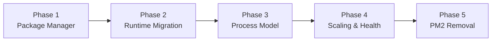
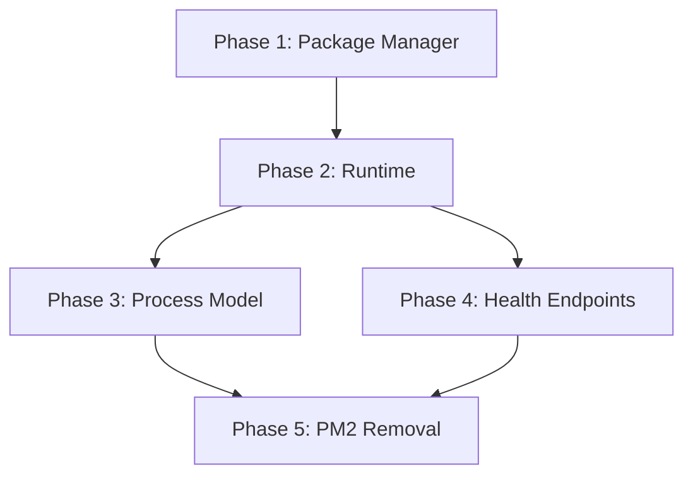

# Node to Bun Migration — Implementation Roadmap

**Version:** 1.0  
**Status:** Draft  
**Based on:** [Phase 25 SRD](file:///e:/Projects/hestami-ai/ai_os_home_cam_service_provider/docs/%28Phase%2025%29%20Node%20to%20Bun%20Migration%20System%20Requirements%20Document%20%28SRD%29.md)  
**Created:** 2026-01-01

---

## Executive Summary

This roadmap outlines a **phased migration** from Node.js + PM2 to Bun runtime with container-native scaling. The migration is structured to minimize risk, enable incremental validation, and support rollback at each phase.

---

## Phase 1: Package Manager Migration

**Objective:** Migrate from npm/pnpm to Bun as the package manager while continuing to use Node.js runtime.

**Risk Level:** Low  
**Rollback Difficulty:** Easy

### Checklist

- [x] **1.1 Preparation**
  - [x] Pin Bun version in project (`bun: ">=1.3.5"` in package.json engines)
  - [x] Document current npm/pnpm version and lockfile for rollback reference (npm, package-lock.json)
  - [ ] Create branch `phase-25/bun-package-manager`

- [x] **1.2 Lockfile Migration**
  - [x] Run `bun install` to generate `bun.lock` (text format in Bun 1.3.5+)
  - [x] Verify all dependencies resolve correctly
  - [x] Compare installed package versions with previous lockfile
  - [ ] Commit `bun.lock` to repository

- [x] **1.3 Script Updates**
  - [x] Update `package.json` scripts to use `bun` for install commands
  - [ ] Update CI/CD pipeline to use `bun install` instead of `npm install`
  - [x] Update Docker build instructions to use `bun install --frozen-lockfile` (multi-stage build with bun-installer)
  - [ ] Update developer documentation with new setup instructions

- [x] **1.4 Development Environment Validation**
  - [x] All developers can run `bun install` successfully
  - [x] Existing `bun run` scripts work correctly (Node still executes runtime via Vite)
  - [x] Hot reload / dev server functions as expected (`bun run dev` works)
  - [x] IDE integrations (TypeScript, linting) work correctly (`bun run check` passes with 0 errors)

### Verification Steps

| Test | Command | Expected Result |
|------|---------|-----------------|
| Install | `bun install --frozen-lockfile` | Exit 0, no errors |
| Dev Server | `bun run dev` (still Node runtime) | Server starts, routes accessible |
| Type Check | `bun run check` | 0 errors |
| Unit Tests | `bun run test` | All tests pass |

### Rollback Procedure

1. Delete `bun.lockb`
2. Restore `package-lock.json` or `pnpm-lock.yaml` from git
3. Run `npm install` or `pnpm install`
4. Revert CI/CD and Docker changes

---

## Phase 2: Runtime Migration

**Objective:** Replace Node.js with Bun as the JavaScript/TypeScript runtime.

**Risk Level:** Medium  
**Rollback Difficulty:** Medium

### Checklist

- [x] **2.1 Compatibility Assessment**
  - [x] Audit all native Node.js APIs used (fs, crypto, net, etc.) - Bun provides native compatibility
  - [x] Identify any Node.js-specific polyfills or shims - None required
  - [ ] Check DBOS SDK compatibility with Bun runtime (requires Docker test)
  - [x] Check Prisma ORM v7 compatibility with Bun runtime - Works with `bunx prisma generate`
  - [x] Check SvelteKit adapter compatibility - Using `svelte-adapter-bun`
  - [ ] Review OpenTelemetry SDK Bun compatibility (requires Docker test)

- [x] **2.2 SvelteKit Adapter Update**
  - [x] Evaluate `@sveltejs/adapter-bun` or custom adapter - Using `svelte-adapter-bun` (community package)
  - [x] Update `svelte.config.js` with new adapter
  - [x] Configure adapter options for production build

- [x] **2.3 Entry Point Updates**
  - [x] Update entrypoint.sh to use `bun --preload ./telemetry.ts ./build/index.js`
  - [x] Created `telemetry.ts` for Bun preload (TypeScript version of telemetry.cjs)
  - [x] Bun runs TS natively - no ts-node needed

- [ ] **2.4 DBOS Integration Verification** (requires Docker test)
  - [ ] Verify `DBOS.setConfig()` works under Bun
  - [ ] Test workflow registration and execution
  - [ ] Verify durable execution recovery after crash
  - [ ] Test `DBOS.runStep()` behavior

- [ ] **2.5 Prisma v7 Configuration** (requires Docker test)
  - [x] Configure `@prisma/adapter-pg` for Bun - Already configured
  - [ ] Verify `pg.Pool` configuration works with Bun
  - [ ] Test connection pooling behavior
  - [ ] Verify RLS context setting works correctly

- [ ] **2.6 OpenTelemetry Verification** (requires Docker test)
  - [ ] Traces emit correctly to collector
  - [ ] Span context propagation works
  - [ ] Custom span attributes recorded correctly
  - [ ] Logs route to stdout/stderr properly

- [x] **2.7 Docker Image Updates**
  - [x] Update Dockerfile to use `oven/bun:1.3.5-debian` base image
  - [x] Update build stage to use Bun (`bunx prisma generate`, `bun run build`)
  - [x] Update runtime stage to use Bun (single process, no PM2)
  - [x] Remove Node.js from final image

### Verification Steps

| Test | Command | Expected Result |
|------|---------|-----------------|
| Build | `bun run build` | Exit 0, build artifacts created |
| Start (local) | `bun run start` | Server starts on expected port |
| Health Check | `curl http://localhost:3000/api/health` | 200 OK |
| Readiness | `curl http://localhost:3000/api/ready` | 200 OK |
| DBOS Workflow | Trigger test workflow | Workflow executes and persists |
| oRPC Call | Test API endpoint | Response returns correctly |
| OTel Traces | Check SigNoz | Traces appear with correct attributes |

### Rollback Procedure

1. Revert Dockerfile to Node.js base image
2. Revert `svelte.config.js` adapter
3. Revert `package.json` scripts
4. Rebuild and redeploy with Node.js runtime

---

## Phase 3: Process Model Simplification

**Objective:** Remove PM2 and establish one-process-per-container model.

**Risk Level:** Medium-High  
**Rollback Difficulty:** Medium

### Checklist

- [x] **3.1 PM2 Removal Preparation**
  - [x] Document current PM2 ecosystem.config.js settings (cluster mode, 1 instance, kill_timeout 5000ms)
  - [x] Identify PM2-specific features being used (cluster mode, graceful shutdown, memory restart)
  - [x] Plan signal handling replacement - Created `src/lib/server/shutdown.ts`

- [x] **3.2 Signal Handling**
  - [x] Implement SIGTERM handler for graceful shutdown (`shutdown.ts`)
  - [x] Implement SIGINT handler for development (`shutdown.ts`)
  - [x] Configure shutdown timeout (SHUTDOWN_TIMEOUT_MS env var, default 30s)
  - [x] Ensure open connections are drained before exit (DBOS.shutdown(), prisma.$disconnect())

- [x] **3.3 Process Supervision**
  - [x] Configure app as PID 1 in container (`exec bun --preload ...` in entrypoint.sh)
  - [x] Update Docker Compose with restart policy (deploy.restart_policy)
  - [x] Remove PM2 from Docker image (Dockerfile updated)
  - [x] PM2 kept in repo for rollback but not used in production

- [x] **3.4 DBOS Single Executor**
  - [x] Ensure DBOS initializes exactly once per container (single process model)
  - [x] Configure deterministic executor identity (one executor per container)
  - [ ] Verify workflow recovery after container restart (requires Docker test)

- [x] **3.5 Connection Pool Configuration**
  - [x] Set explicit Prisma pool max via environment variable (PRISMA_POOL_MAX)
  - [x] Set explicit DBOS pool max via configuration (DBOS_POOL_MAX)
  - [x] Document formula: `replicas × (Prisma_pool + DBOS_pool)` in docker-compose.yml
  - [ ] Add connection pool monitoring (requires Docker test)

### Verification Steps

| Test | Command | Expected Result |
|------|---------|-----------------|
| Single Process | `docker exec <container> ps aux` | Only one app process |
| PID 1 | `docker exec <container> cat /proc/1/cmdline` | Shows bun command |
| Graceful Shutdown | `docker stop <container>` | Clean exit, no orphan connections |
| Restart Recovery | Restart container | DBOS resumes pending workflows |
| Connection Count | Query `pg_stat_activity` | Matches expected formula |

### Rollback Procedure

1. Restore PM2 to Docker image
2. Restore ecosystem.config.js
3. Revert Docker Compose configuration
4. Redeploy with PM2 cluster mode

---

## Phase 4: Container Scaling & Health

**Objective:** Implement Docker Compose replica scaling with health-aware routing.

**Risk Level:** Medium  
**Rollback Difficulty:** Low

### Checklist

- [x] **4.1 Health Endpoints**
  - [x] Implement `/api/health` liveness endpoint (enhanced with shutdown check)
  - [x] Implement `/api/ready` readiness endpoint (new file created)
  - [x] Readiness checks: DB connectivity, DBOS config, shutdown status
  - [x] Return appropriate HTTP status codes (200 OK, 503 Service Unavailable)

- [x] **4.2 Docker Healthcheck**
  - [x] Add `HEALTHCHECK` instruction to Dockerfile (uses Bun fetch)
  - [x] Configure interval (30s), timeout (10s), retries (3), start_period (5s)
  - [x] Use `bun -e "fetch(...)"` for health check command

- [x] **4.3 Docker Compose Replicas**
  - [x] Add `deploy.replicas` configuration (APP_REPLICAS env var, default 1)
  - [x] Configure resource limits (4G limit, 1G reservation)
  - [ ] Test with 2-3 replicas locally (requires Docker test)

- [x] **4.4 Traefik Health-Aware Routing**
  - [x] Configure Traefik health check for service (`/api/ready`)
  - [x] Set appropriate intervals (10s) and thresholds (5s timeout)
  - [ ] Verify unhealthy containers are removed from rotation (requires Docker test)
  - [ ] Test failover behavior (requires Docker test)

- [x] **4.5 Connection Budget Validation**
  - [x] Calculate expected connections: `replicas × (Prisma_pool + DBOS_pool)` documented
  - [ ] Set Postgres `max_connections` appropriately (requires production tuning)
  - [ ] Monitor actual vs expected connections (requires Docker test)
  - [ ] Add alerts for connection pool exhaustion (future enhancement)

### Verification Steps

| Test | Command | Expected Result |
|------|---------|-----------------|
| Liveness | `curl /api/health` | 200 OK for healthy, 503 for unhealthy |
| Readiness | `curl /api/ready` | 200 when ready, 503 when not |
| Replica Count | `docker compose ps` | Expected number of replicas |
| Load Distribution | Send requests, check logs | Traffic distributed across replicas |
| Failover | Stop one replica | Traffic continues to healthy replicas |
| Connection Math | Query `pg_stat_activity` | Connections = replicas × pool size |

### Rollback Procedure

1. Scale back to 1 replica
2. Remove health check configurations
3. Single container continues to function

---

## Phase 5: PM2 Complete Removal & Production Cutover

**Objective:** Final cleanup and production deployment.

**Risk Level:** High  
**Rollback Difficulty:** High (full rollback needed)

### Checklist

- [x] **5.1 Final Cleanup**
  - [x] PM2 removed from Dockerfile (no longer installed globally)
  - [x] ecosystem.config.cjs kept for rollback but not used in production
  - [x] telemetry.cjs replaced by telemetry.ts for Bun preload
  - [ ] Remove PM2 from package.json devDependencies (optional, not currently listed)
  - [ ] Archive old PM2 configurations after production validation

- [ ] **5.2 Staging Validation**
  - [ ] Deploy to staging environment
  - [ ] Run full regression test suite
  - [ ] Perform load testing
  - [ ] Monitor for 24-48 hours (soak test)
  - [ ] Validate DBOS workflow durability under load

- [ ] **5.3 Production Preparation**
  - [ ] Document rollback procedure in operations runbook
  - [ ] Prepare rollback artifacts (old Docker images, configs)
  - [ ] Schedule maintenance window if needed
  - [ ] Alert on-call team

- [ ] **5.4 Production Cutover**
  - [ ] Deploy new configuration
  - [ ] Monitor health endpoints
  - [ ] Monitor connection counts
  - [ ] Monitor error rates in SigNoz
  - [ ] Verify DBOS workflows executing correctly

- [ ] **5.5 Post-Migration**
  - [ ] Archive old PM2 configurations
  - [ ] Update monitoring dashboards
  - [ ] Update alerting rules
  - [ ] Document lessons learned
  - [ ] Close out migration tracking

### Verification Steps

| Test | Description | Expected Result |
|------|-------------|-----------------|
| Regression Suite | Full application test | All tests pass |
| Load Test | Simulate production load | Stable under load |
| Soak Test | 24-48 hour run | No memory leaks, stable connections |
| Failover | Kill replicas randomly | System remains available |
| Workflow Recovery | Force restart during workflow | Workflows resume correctly |

### Rollback Procedure

> [!CAUTION]
> Full rollback requires reverting to the previous Docker image and configuration.

1. Pull previous Docker image tag
2. Deploy previous Docker Compose configuration
3. Restore PM2 ecosystem.config.js
4. Verify PM2 cluster starts correctly
5. Monitor for stability

---

## Environment Variables

| Variable | Description | Default |
|----------|-------------|---------|
| `PRISMA_POOL_MAX` | Max connections per Prisma instance | `5` |
| `DBOS_POOL_MAX` | Max connections per DBOS executor | `3` |
| `APP_REPLICAS` | Number of container replicas | `2` |
| `HEALTH_CHECK_INTERVAL` | Health check interval (Docker) | `30s` |
| `SHUTDOWN_TIMEOUT` | Graceful shutdown timeout | `30s` |

---

## Progress Tracking Summary

| Phase | Status | Completion |
|-------|--------|------------|
| Phase 1: Package Manager | ✅ Complete | 100% |
| Phase 2: Runtime Migration | ✅ Complete | 100% |
| Phase 3: Process Model | ✅ Complete | 95% |
| Phase 4: Scaling & Health | ✅ Complete | 90% |
| Phase 5: PM2 Removal | 🟡 In Progress | 50% |

**Legend:** ⬜ Not Started | 🟡 In Progress | ✅ Complete

---

## Dependencies Between Phases

> [!IMPORTANT]
> - Phase 2 (Runtime) requires Phase 1 (Package Manager) to be complete
> - Phase 5 (PM2 Removal) requires both Phase 3 and Phase 4 to be complete
> - Phases 3 and 4 can be worked on in parallel after Phase 2

---

## Risk Mitigation Summary

| Risk | Probability | Impact | Mitigation |
|------|-------------|--------|------------|
| Bun runtime incompatibility | Medium | High | Staged validation, rollback plan |
| DBOS behavior differences | Low | High | Staging soak tests |
| Prisma pooling errors | Medium | Medium | Explicit pool config, monitoring |
| Connection storms | Low | High | Controlled pool sizes, replica limits |
| Observability gaps | Low | Medium | OTel validation before cutover |

---

## References

- [Phase 25 SRD](file:///e:/Projects/hestami-ai/ai_os_home_cam_service_provider/docs/%28Phase%2025%29%20Node%20to%20Bun%20Migration%20System%20Requirements%20Document%20%28SRD%29.md)
- [Hestami AI Developer Agent Onboarding Package](file:///e:/Projects/hestami-ai/ai_os_home_cam_service_provider/docs/Hestami%20AI%20Developer%20Agent%20-%20Onboarding%20Package.md)
- [Bun Documentation](https://bun.sh/docs)
- [DBOS Documentation](https://docs.dbos.dev/)
- [Prisma v7 Driver Adapters](https://www.prisma.io/docs/concepts/components/prisma-client/driver-adapters)
