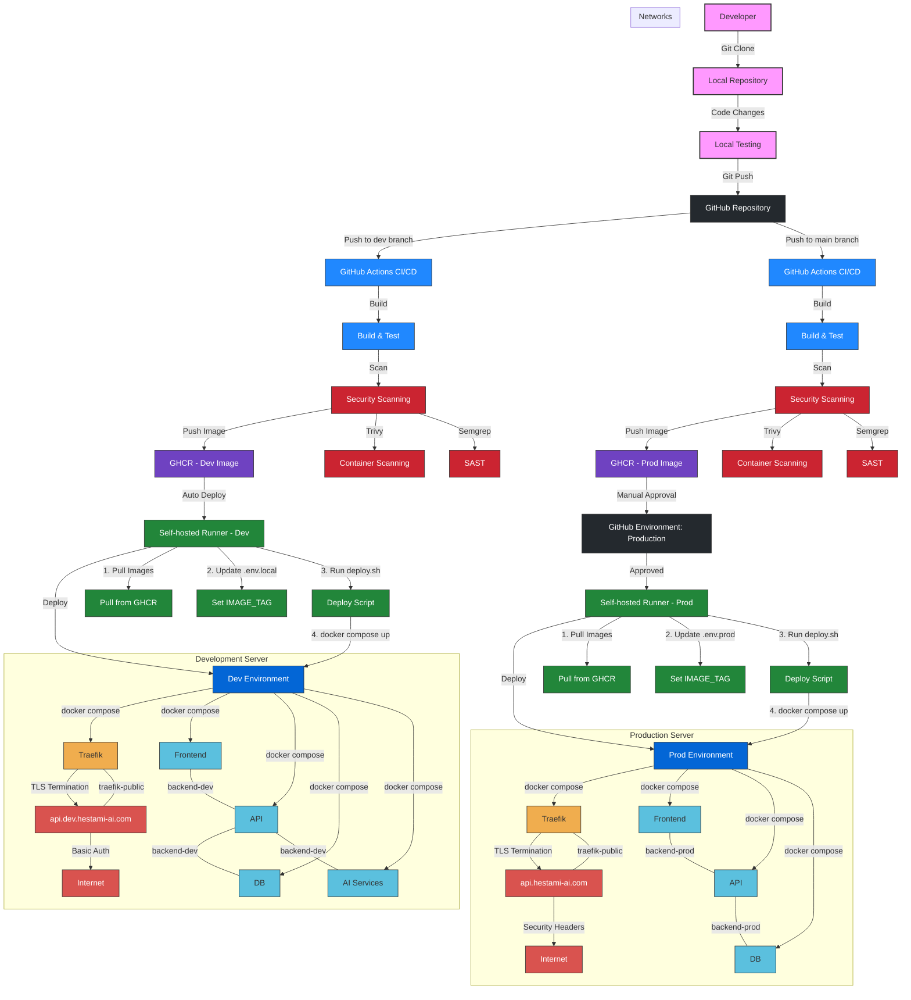

# DevSecOps Architecture Diagram

## CI/CD Pipeline Flow: From Developer to Production

## Component Details

### Developer Workflow
1. Developer clones the repository locally
2. Makes code changes and tests locally
3. Pushes changes to GitHub repository
   - Push to `dev` branch for development deployment
   - Push to `main` branch for production deployment

### CI/CD Pipeline - Development
1. GitHub Actions triggered on push to `dev` branch
2. Build and test the application
3. Security scanning with Trivy and Semgrep
4. Push container image to GitHub Container Registry (GHCR)
5. Self-hosted runner automatically deploys to development environment:
   - Pulls latest image from GHCR
   - Updates `.env.local` with new image tag
   - Runs deployment script
   - Executes `docker compose` commands to update services

### CI/CD Pipeline - Production
1. GitHub Actions triggered on push to `main` branch
2. Build and test the application
3. Security scanning with Trivy and Semgrep
4. Push container image to GitHub Container Registry (GHCR)
5. Manual approval required in GitHub Environment: Production
6. After approval, self-hosted runner deploys to production environment:
   - Pulls latest image from GHCR
   - Updates `.env.prod` with new image tag
   - Runs deployment script
   - Executes `docker compose` commands to update services

### Environment Architecture
- **Development Environment**:
  - Traefik as edge service (port 443)
  - Frontend (SvelteKit)
  - API (Django)
  - Database (PostgreSQL)
  - AI Services (FastAPI, Ollama, VLLM)
  - Protected by basic auth and IP allowlist
  - Accessible at api.dev.hestami-ai.com

- **Production Environment**:
  - Traefik as edge service (port 443)
  - Frontend (Next.js)
  - API (Django)
  - Database (PostgreSQL)
  - Enhanced security headers
  - Accessible at api.hestami-ai.com

### Networks
- `traefik-public`: External network for internet-facing services
- `backend-dev`: Internal network for development services
- `backend-prod`: Internal network for production services
- `temporal-network`: External network for temporal services (not shown in diagram)

## Security Features
- TLS termination at Traefik
- Container image scanning with Trivy
- Static Application Security Testing (SAST) with Semgrep
- Basic auth protection for development environment
- Enhanced security headers for production
- Secure environment variables management
- Manual approval gate for production deployments
