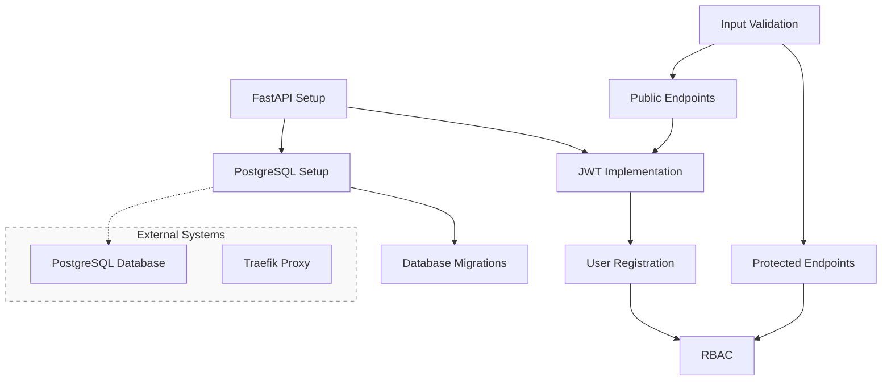

# Requirements Traceability Matrix

## Overview
This document maps system requirements to their implementation phases, verification methods, and success criteria. Each requirement is given a unique ID and tracked through the development process.

## ID Format
- **AUTH-**: Authentication requirements
- **USER-**: User management requirements
- **API-**: API endpoint requirements
- **SEC-**: Security requirements
- **DB-**: Database requirements
- **SYS-**: System requirements
- **DOC-**: Documentation requirements

## Traceability Matrix

| Req ID | Requirement Description | Implementation Phase | Success Criteria | Status |
|--------|------------------------|---------------------|------------------|---------|
| **User Management** |
| USER-001 | User registration with email and password | Phase 2: Core Authentication | Successful user creation with validation | Completed |
| USER-002 | User profile management | Phase 2: Core Authentication | Profile CRUD operations working | Completed |
| USER-003 | Role-based access control | Phase 2: Core Authentication | Role assignment and verification working | Completed |
| USER-004 | Password reset functionality | Phase 2: Core Authentication | Password reset flow complete | Not Started |

| **Authentication** |
| AUTH-001 | JWT token generation | Phase 2: Core Authentication | Tokens generated and validated | Completed |
| AUTH-002 | Token refresh mechanism | Phase 2: Core Authentication | Token refresh working | Completed |
| AUTH-003 | Secure password hashing | Phase 2: Core Authentication | Passwords properly hashed with bcrypt | Completed |
| AUTH-004 | Login/logout functionality | Phase 2: Core Authentication | Session management working | Completed |

| **API Endpoints** |
| API-001 | Public authentication endpoints | Phase 3: API Development | Endpoints accessible and working | Completed |
| API-002 | Protected user endpoints | Phase 3: API Development | Authorization working | Completed |
| API-003 | Property management endpoints | Phase 3: API Development | CRUD operations for properties | Completed |
| API-004 | Service management endpoints | Phase 3: API Development | CRUD operations for services | Completed |

| **Security** |
| SEC-001 | Input validation | Phase 3: API Development | All inputs properly validated | Completed |
| SEC-002 | Rate limiting | Phase 3: API Development | Rate limiting implemented | Not Started |
| SEC-003 | CORS configuration | Phase 3: API Development | CORS properly configured | Completed |
| SEC-004 | SQL injection prevention | Phase 1: Initial Setup | ORM usage verified | Completed |

| **Database** |
| DB-001 | PostgreSQL setup | Phase 1: Initial Setup | Database connection working | Completed |
| DB-002 | Database migrations | Phase 1: Initial Setup | Alembic migrations working | Completed |
| DB-003 | Model relationships | Phase 1: Initial Setup | Proper foreign key constraints | Completed |
| DB-004 | Async database operations | Phase 1: Initial Setup | Async operations working | Completed |

| **System** |
| SYS-001 | FastAPI application setup | Phase 1: Initial Setup | Application running | Completed |
| SYS-002 | Docker configuration | Phase 5: Deployment | Container building and running | Completed |
| SYS-003 | Environment configuration | Phase 1: Initial Setup | Environment variables working | Completed |
| SYS-004 | Health check endpoints | Phase 5: Deployment | Health checks responding | Completed |

| **Documentation** |
| DOC-001 | API documentation | Phase 4: Documentation | OpenAPI docs generated | Not Started |
| DOC-002 | Setup instructions | Phase 4: Documentation | README complete | Completed |
| DOC-003 | Developer guidelines | Phase 4: Documentation | Guidelines documented | Not Started |
| DOC-004 | Deployment procedures | Phase 4: Documentation | Procedures documented | Not Started |

## Verification Methods

Each requirement will be verified using one or more of the following methods:

1. **Unit Tests**: Individual component testing
2. **Integration Tests**: Component interaction testing
3. **Manual Testing**: Human verification of functionality
4. **Code Review**: Peer review of implementation
5. **Documentation Review**: Verification of documentation completeness

## Out of Scope Requirements

The following requirements are explicitly marked as out of scope for the MVP:

| Req ID | Requirement Description | Reason for Exclusion |
|--------|------------------------|---------------------|
| PERF-001 | Performance optimization | Not critical for MVP |
| MON-001 | Advanced monitoring | Basic monitoring sufficient for MVP |
| CI-001 | CI/CD pipeline | Manual deployment acceptable for MVP |
| HA-001 | High availability | Single instance sufficient for MVP |
| TEST-001 | Advanced testing infrastructure | Basic testing sufficient for MVP |
| INT-001 | Traefik integration | Will be handled post-MVP |
| DB-005 | Database connection pooling | Basic connection sufficient for MVP |
| SEC-005 | TLS termination | Will be handled by external system post-MVP |
| SYS-005 | Service discovery | Not needed for MVP |
| NET-001 | Advanced networking features | Basic networking sufficient for MVP |

## Requirement Dependencies

## Success Criteria Mapping

Each requirement's success is measured against specific criteria:

1. **Functionality**: Feature works as specified
2. **Security**: Meets security requirements
3. **Performance**: Meets basic performance needs
4. **Documentation**: Properly documented
5. **Testing**: Has appropriate test coverage

## Status Tracking

Requirements status will be updated throughout development:

- **Not Started**: Implementation not begun
- **In Progress**: Currently being implemented
- **Completed**: Implementation finished
- **Verified**: Tested and confirmed working
- **Documented**: Documentation complete

**Current Progress Summary**:
- Phase 1 (Initial Setup): 100% Complete
- Phase 2 (Core Authentication): 75% Complete (Password reset pending)
- Phase 3 (API Development): 90% Complete (Rate limiting pending)
- Phase 4 (Documentation): 25% Complete
- Phase 5 (Deployment): Basic setup complete, integration items marked as out of scope for MVP
